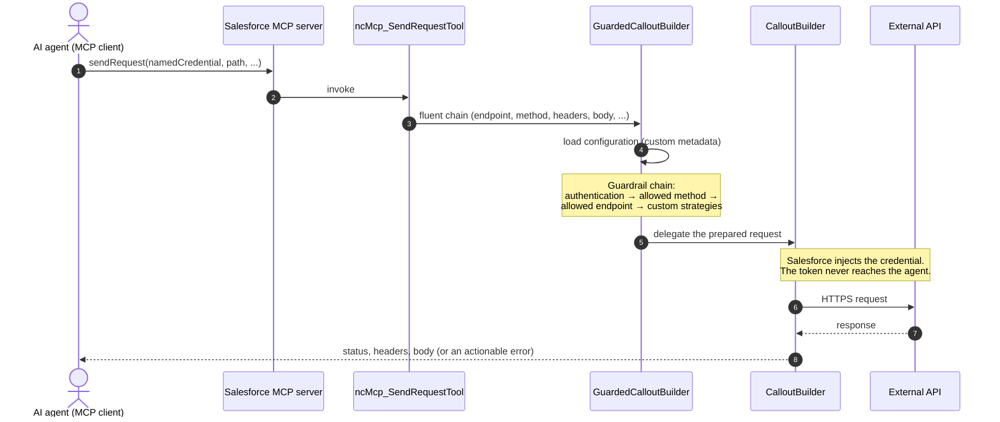

# Named Credentials MCP — How It Works

Named Credentials MCP (ncMCP) is a set of Salesforce-hosted MCP tools that let an AI agent call external APIs **through the org's Named Credentials**. Salesforce injects the authentication into every request, so no token, key, or secret ever reaches the agent — the agent only ever sees a credential's *name*. Every request passes through a chain of admin-defined guardrails before it leaves the org.

## The tools

An agent works through three tools, in this order:

| # | Tool | Returns | Does **not** return |
| --- | --- | --- | --- |
| 1 | `listCredentials` | The credentials exposed through the server and whether each is ready to use: name, `isConfigured`, base URL, principal type. Unauthenticated credentials are listed too — `isConfigured=false` plus the principal type tells the agent (and the user) which kind of authorization is missing. | Anything about *how* to call the API. |
| 2 | `describe` | The usage contract for **one** credential: purpose, base URL, reference documentation URL, allowed HTTP methods, allowed endpoint patterns. Fails with an actionable error when the credential is unknown or not authenticated. | The credential inventory — that is `listCredentials`. |
| 3 | `sendRequest` | The response (status, headers, body) of a guarded HTTP request sent through one credential. Guardrail violations and HTTP 4xx/5xx surface as errors whose messages carry the reason and the response body. | Anything the guardrails refuse. |

## Request lifecycle

Everything converges on one class: `GuardedCalloutBuilder`, a decorator around the [CalloutBuilder](../calloutBuilder/classes/CalloutBuilder.cls) library. It lives in its own MCP-independent [module](../guardedCalloutBuilder/classes/README.md): it mirrors CalloutBuilder's public API and adds configuration loading, input normalization, and the guardrail chain before delegating the actual callout.



A blocked request never reaches the network: any guardrail may throw, and the error message — "method DELETE is not allowed, allowed methods: GET, POST" — goes back to the agent so it can self-correct.

## Guardrails and the trust model

- **Nothing is exposed by default.** A Named Credential becomes visible to the tools only when an administrator activates a configuration record for it. The configuration also carries the guardrail rules.
- **Conservative defaults.** With no explicit configuration, only `GET` is allowed.
- **Authentication is checked per running context.** A per-user credential counts only when the current user has authorized it; a named principal counts when an administrator has configured it. `listCredentials` reveals existence and status of every exposed credential; `describe` and `sendRequest` refuse unauthenticated ones.
- **Built-in chain, fixed order:** authentication → allowed HTTP method → allowed endpoint pattern → custom guardrails.
- **Custom guardrails are strategies.** A configuration can name Apex classes implementing `CalloutGuardrail`; they run after the built-ins and can inspect the whole request (method, path, headers, body) — rules the declarative config cannot express. They are referenced by admins in protected metadata, so they sit inside the same trust boundary as any admin-authored automation.

## Beyond MCP

The tools are plain invocable actions, so the same three operations are available to Flows and Agentforce without extra code. From Apex, the [GuardedCalloutBuilder](../guardedCalloutBuilder/classes/README.md) decorator *is* the API — any callout can opt into guardrail enforcement:

```apex
HttpResponse response = new GuardedCalloutBuilder('OpenAI_NC')
    .withEndpoint('/v1/models')
    .getHttpResponse();
```

It mirrors the full CalloutBuilder API (`withHeader`, `withTimeout`, `withSuccessType`, `getTypedResponseBody`, ...), with a few deliberate differences: query parameters are appended to the URL for every HTTP method, String bodies are sent verbatim (never re-serialized), the timeout defaults to 30 seconds and is clamped to platform bounds, and `Content-Type` defaults to `application/json` when a body is present.

## Configuration and setup

The org setup checklist lives in the [module reference](classes/README.md). The guardrail engine — the configuration record format, the custom-guardrail how-to, and direct Apex usage — lives in the separate [GuardedCalloutBuilder](../guardedCalloutBuilder/classes/README.md) module.
